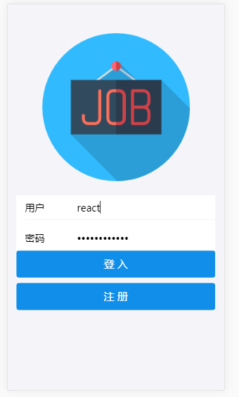
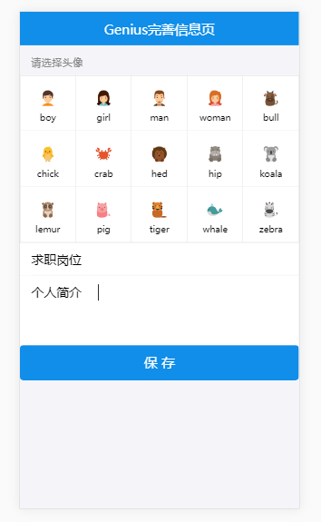
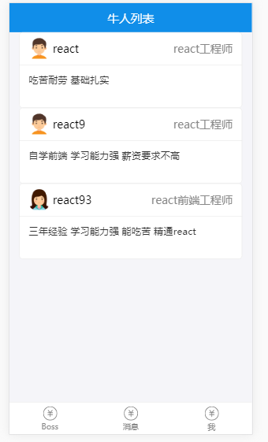

### 招聘APP

#### 技术选型
基于React16 + Redux + React Router4 + Antd Mobile 开发的复杂单页面招聘App，后端使用 Node.js + express + MongoDB 搭建，并使用 socket.io 实现了简单的实时聊天功能

#### 运行项目
- yarn install (或npm)
- yarn start 

项目启动前先开启后端server： node server/server.js (如果本地没有配置好 MongoDB 数据库，需要先进行数据库的配置)

项目启动后访问：http://localhost:3000/register，并开启 chrome 的移动端模式。
  

进行注册，可以选择boss和genius两种身份，注册（或首次登入）完成后会跳转进入到信息完善页面。

接下来，如果身份是Genius，将会看到Boss列表，反之身份是boss将会看到Genius列表。
 

最后是利用socket.io实现聊天页面，和个人中心。

### 后续
还有很多很多需要优化的地方，如页面的跳转逻辑，样式也太简陋了...，还有性能优化方面，虽然这只是个很小的项目，后续有时间也会增加其他的功能。

这是我个人的第一个完整的React项目，通过这个项目算是对React的使用有了一个大致的了解。当然需要学习的地方还有太多太多...

