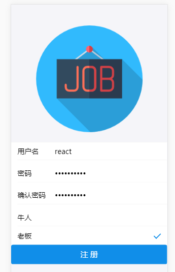
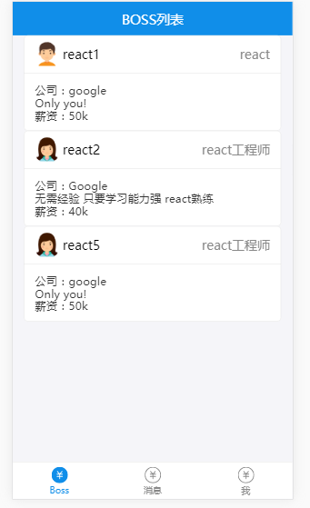
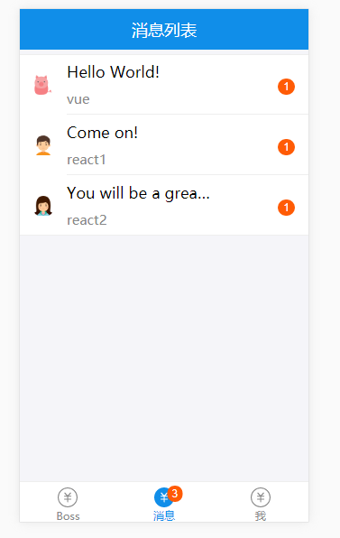
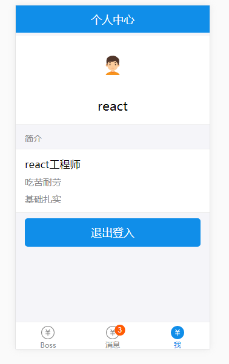
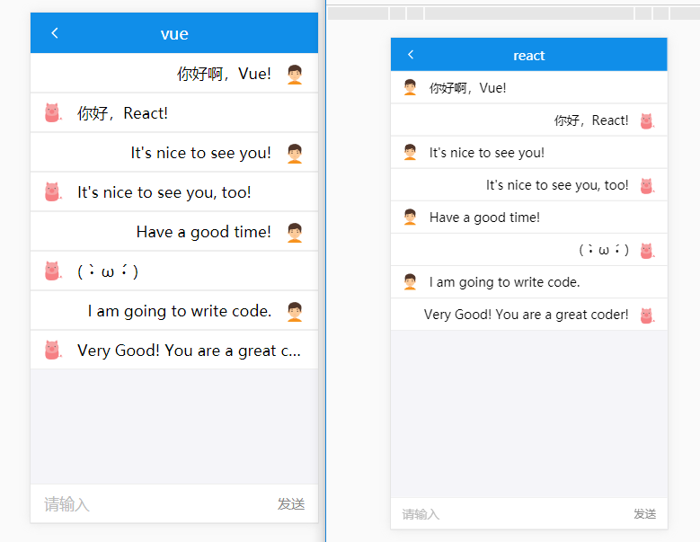

## 招聘APP

### 技术选型
基于React16 + Redux + React Router4 + Antd Mobile 开发的复杂单页面招聘App，后端使用 Node.js + express + MongoDB 搭建，并使用 socket.io 实现了简单的实时聊天功能

### 运行项目
- yarn install (或npm)
- yarn start 

项目启动前先开启后端server： node server/server.js (如果本地没有配置好 MongoDB 数据库，需要先进行数据库的配置)

项目启动后访问：http://localhost:3000/register，并开启 chrome 的移动端模式；
  

进行注册，可以选择boss和genius两种身份，注册（或首次登入）完成后会跳转进入到信息完善页面；

接下来，如果身份是Genius，将会看到Boss列表，反之身份是boss将会看到Genius列表；
 

最后是消息列表和个人中心。

 

以及利用 socket.io 实现的实时聊天页面
)

## 后续
已经基本更新完成...有时间会继续进一步的优化...

